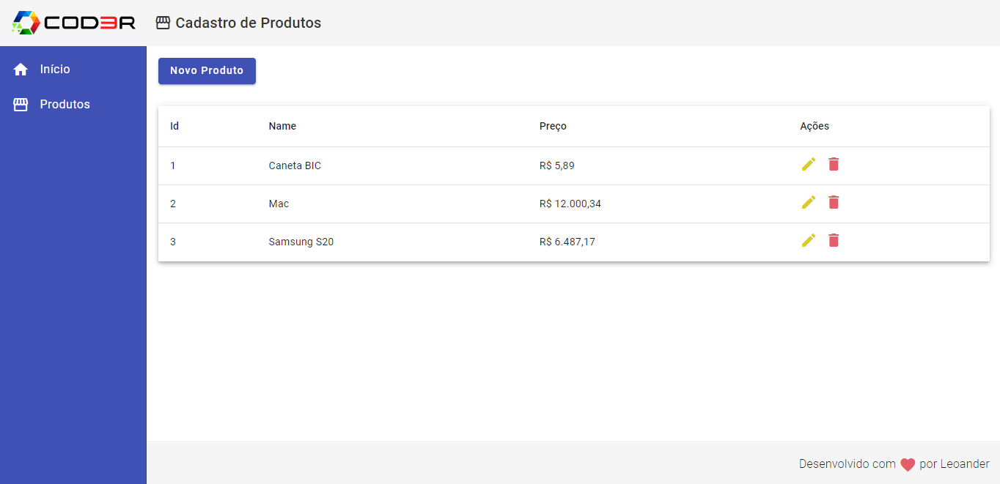

# Projeto de Cadastro de Produtos

Este é um projeto desenvolvido no curso da [COD3R](https://www.cod3r.com.br/), utilizando Node.js no backend e Angular no frontend. O objetivo do projeto é criar um CRUD (Create, Read, Update, Delete) para o cadastro de produtos.




## Backend

### Instalação

Para instalar as dependências do backend, é necessário executar o seguinte comando no terminal:

```
cd backend && npm install
```

### Start do servidor

Para iniciar o servidor backend, utilize o seguinte comando:

```
npm start
```

Este comando irá iniciar o servidor utilizando o Node.js e configurar o json-server para assistir ao arquivo "db.json" e utilizar a porta 3001.

## Frontend

### Instalação

Para instalar as dependências do frontend, é necessário executar o seguinte comando no terminal:

```
cd frontend && npm install
```

### Start do projeto

Para iniciar o projeto frontend, utilize o seguinte comando:

```
npm start
```

Este comando irá iniciar o projeto Angular e abrirá o navegador com a aplicação em execução.

## Observações

Certifique-se de ter o Node.js e o Angular CLI instalados em sua máquina antes de iniciar o projeto.

No backend, o json-server é utilizado para simular um servidor RESTful a partir do arquivo "db.json". Certifique-se de que o arquivo "db.json" esteja corretamente configurado com os dados de exemplo para o cadastro de produtos.

No frontend, a aplicação Angular foi desenvolvida para fornecer as funcionalidades básicas de um CRUD para o cadastro de produtos. Certifique-se de que todas as dependências estejam corretamente instaladas antes de iniciar o projeto.

## Considerações Finais

Este projeto foi desenvolvido com base nos conhecimentos adquiridos no curso da Cod3r e tem como objetivo demonstrar a criação de um sistema de cadastro de produtos utilizando Node.js no backend e Angular no frontend. Sinta-se à vontade para explorar e modificar o projeto de acordo com suas necessidades.
